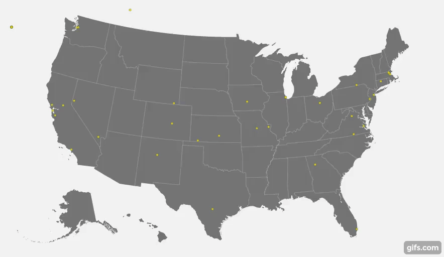

# locviz: visualize ips on the map

This is a simple tool to visualize ip addresses on a map. For example, you can use it to monitor realtime stream of ip addresses from Web application request log.

# Usage

   * Clone the git repo: `git clone https://github.com/guozheng/locviz.git`
   * Install package manager (we use [yarn](https://yarnpkg.com/en/)) libs: `brew install yarn && yarn install`
   * Start test client that writes ips to `/tmp/request-ips`: `yarn startTestClient`
   * Start the server and point Web browser to `http://localhost:8080`

# acknowledgement

   * Code is based on [Alan Eng](https://bl.ocks.org/alaneng/)'s [snippet](https://bl.ocks.org/alaneng/14cec7865dc5faf91ebb551878b4b010). It takes each zip code object that contains lat and lon and plots them on the map.
   * Many thanks for the libs used in `package.json` such as D3.js, Express, socket.io, socket.io stream, tail-stream, maxmind, etc.
   * IP to location mapping is done using the free [MaxMind geolite2 data](https://dev.maxmind.com/geoip/geoip2/geolite2/). It is from a manual download, there exists an [update program](https://dev.maxmind.com/geoip/geoipupdate/). Other similar data packs can be found in this [IP-based Geolocation FAQ article](https://www.iplocation.net/).